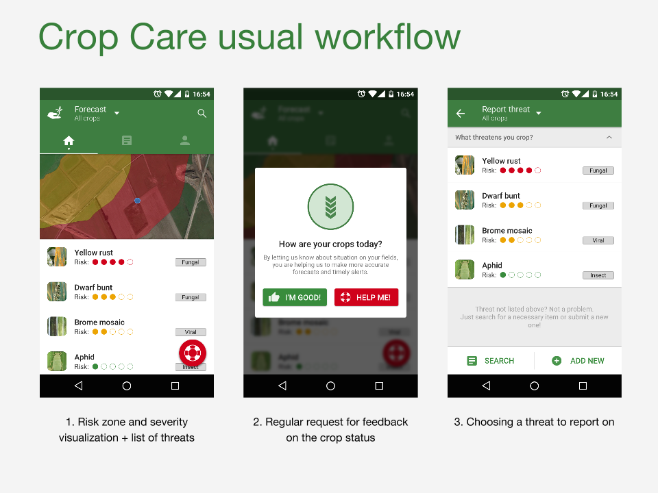
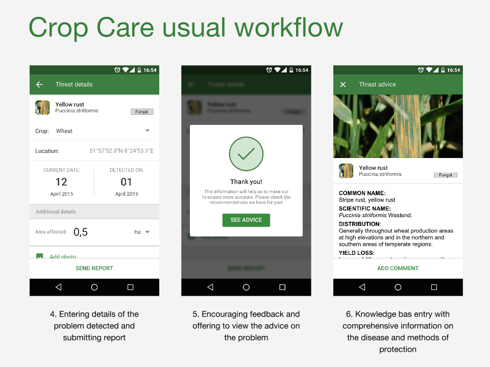

#Crop Care
Protecting crops against pests and disease

Service which facilitates efficient crop care and yield improvement through analysis, advice and timely alerts based on crowd-sourced crop pest and disease data.

Service based on three modules
- Pest/Disease forecast and alerts. Map and list of possible pest/disease based on open-sourced data.
- Getting data from user. One question - one answer: Are your crops healthy? Yes/No - if No, then enter pest/disease data.
- Pest/Disease knowledge database. Information about pest/disease, photos, recommendations on protection.

Project Web Page  https://2015.spaceappschallenge.org/project/crop-care---/

## Crop Care android applicaton

APK for installing application
https://drive.google.com/a/cloud4land.com/file/d/0ByFCvYaUtYxXZThPS0NQTDJSMTg/view?usp=sharing

Sources of mobile application: https://bitbucket.org/Forsety/crop-care-android/

## Crop Care API server 

Demo of API host's CropCare on Heroky
https://cropcare-api.herokuapp.com/

Sourcescodes of CropCare API server follow this link
https://github.com/maximchukm/cropcare-api

Example:
Request: https://cropcare-api.herokuapp.com/alert

Response [{"date":"Mon Apr 13 09:25:24 UTC 2015","disease":{"rate":5,"name":"Yellow rust","id":2,"type":"FUNGAL"},"id":1,"crop":{"name":"wheat","id":1}},{"date":"Mon Apr 13 09:26:35 UTC 2015","disease":{"rate":5,"name":"Yellow rust","id":2,"type":"FUNGAL"},"id":2,"crop":{"name":"wheat","id":1}},{"date":"Mon Apr 13 09:27:29 UTC 2015","disease":{"rate":5,"name":"Yellow rust","id":2,"type":"FUNGAL"},"id":3,"crop":{"name":"wheat","id":1}},{"date":"Mon Apr 13 09:28:51 UTC 2015","disease":{"rate":5,"name":"Yellow rust","id":2,"type":"FUNGAL"},"location":{"lng":11.163377,"id":1,"lat":49.33436},"id":4,"crop":{"name":"wheat","id":1}}]

